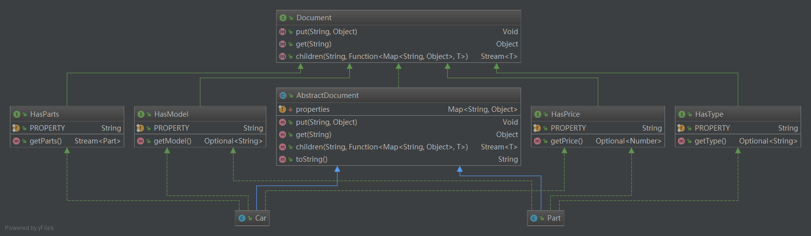

## 意图
实现无类型语言的灵活性并保持类型安全 

## 适用性
使用抽象文档模式时

* 有需要动态添加新的属性
* 你想要一个灵活的方式来组织树状结构域
* 你想要更松散的耦合系统

## 参考

* [Wikipedia: Abstract Document Pattern](https://en.wikipedia.org/wiki/Abstract_Document_Pattern)
* [Martin Fowler: Dealing with properties](http://martinfowler.com/apsupp/properties.pdf)