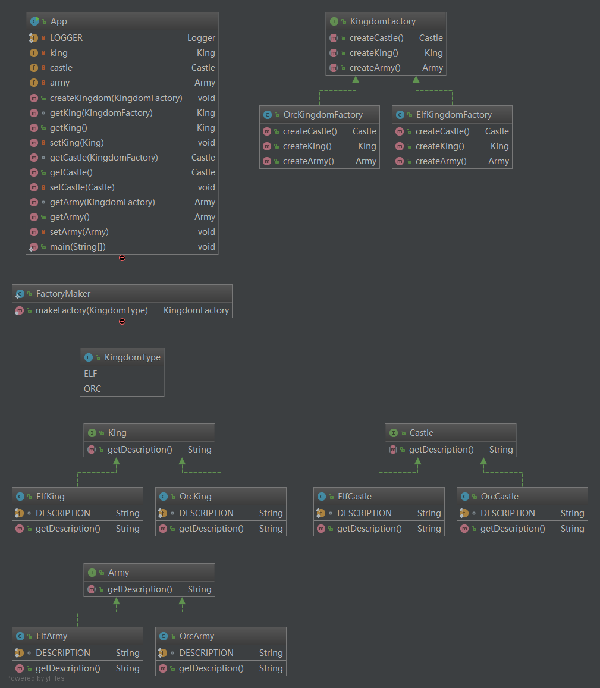

## 也被称为
套件

## 意图
提供一个用于创建相关或相关系列的界面
对象，而不指定具体的类。

##说明
真实世界的例子

>要创造一个王国，我们需要有共同主题的物体。 精灵王国需要一个精灵王，精灵城堡和精灵军，而兽人王国需要一个兽人王，兽人城堡和兽人军。 王国中的物体之间有依赖关系。

用简单的话来说

>工厂工厂; 一个工厂，将个别但相关/依赖的工厂分组在一起，而不指定具体的类别。

维基百科说

>抽象工厂模式提供了一种方法来封装一组具有共同主题的单个工厂，而不指定具体的类

**编程示例**

翻译上面的王国的例子。 首先，我们有一些界面和实施的王国对象

```java
public interface Castle {
  String getDescription();
}
public interface King {
  String getDescription();
}
public interface Army {
  String getDescription();
}

// Elven implementations ->
public class ElfCastle implements Castle {
  static final String DESCRIPTION = "This is the Elven castle!";
  @Override
  public String getDescription() {
    return DESCRIPTION;
  }
}
public class ElfKing implements King {
  static final String DESCRIPTION = "This is the Elven king!";
  @Override
  public String getDescription() {
    return DESCRIPTION;
  }
}
public class ElfArmy implements Army {
  static final String DESCRIPTION = "This is the Elven Army!";
  @Override
  public String getDescription() {
    return DESCRIPTION;
  }
}

// Orcish implementations similarly...

```

然后我们有王国工厂的抽象和实现

```java
public interface KingdomFactory {
  Castle createCastle();
  King createKing();
  Army createArmy();
}

public class ElfKingdomFactory implements KingdomFactory {
  public Castle createCastle() {
    return new ElfCastle();
  }
  public King createKing() {
    return new ElfKing();
  }
  public Army createArmy() {
    return new ElfArmy();
  }
}

public class OrcKingdomFactory implements KingdomFactory {
  public Castle createCastle() {
    return new OrcCastle();
  }
  public King createKing() {
    return new OrcKing();
  }
  public Army createArmy() {
    return new OrcArmy();
  }
}
```

现在我们有我们的抽象工厂，让我们做相关对象的家庭，即精灵王国工厂创造精灵城堡，国王和军队等。

```java
KingdomFactory factory = new ElfKingdomFactory();
Castle castle = factory.createCastle();
King king = factory.createKing();
Army army = factory.createArmy();

castle.getDescription();  // Output: This is the Elven castle!
king.getDescription(); // Output: This is the Elven king!
army.getDescription(); // Output: This is the Elven Army!

```

现在，我们可以为我们不同的王国工厂设计一个工厂。 在这个例子中，我们创建了`FactoryMaker`，负责返回`ElfKingdomFactory`或`OrcKingdomFactory`的一个实例。
客户端可以使用`FactoryMaker`创建所需的哪一个具体的工厂，反过来，他们将生产不同的具体对象（军队，国王，城堡）。
在这个例子中，我们也使用了一个枚举来参数化客户端要求的王国工厂的类型。

```java
public static class FactoryMaker {

  public enum KingdomType {
    ELF, ORC
  }

  public static KingdomFactory makeFactory(KingdomType type) {
    switch (type) {
      case ELF:
        return new ElfKingdomFactory();
      case ORC:
        return new OrcKingdomFactory();
      default:
        throw new IllegalArgumentException("KingdomType not supported.");
    }
  }
}

public static void main(String[] args) {
  App app = new App();

  LOGGER.info("Elf Kingdom");
  app.createKingdom(FactoryMaker.makeFactory(KingdomType.ELF));
  LOGGER.info(app.getArmy().getDescription());
  LOGGER.info(app.getCastle().getDescription());
  LOGGER.info(app.getKing().getDescription());

  LOGGER.info("Orc Kingdom");
  app.createKingdom(FactoryMaker.makeFactory(KingdomType.ORC));
  -- similar use of the orc factory
}
```


## 适用性
使用抽象工厂模式时

* 一个系统应该独立于产品的创建，组成和代表
* 系统应配置多个产品系列中的一个
* 一系列相关产品对象被设计为一起使用，并且您需要强制执行此限制
* 你想提供一个产品类库，你只想揭示他们的接口，而不是他们的实现
* 依赖的生命周期在概念上比消费者的生命周期短。
* 您需要运行时值来构建特定的依赖关系
* 您想在运行时决定从家庭中调用哪个产品。
* 您需要提供一个或多个只在运行时已知的参数，然后才能解析相关性。

＃＃ 用例：

* 选择在运行时调用适当的`FileSystemAcmeService`或`DatabaseAcmeService`或`NetworkAcmeService`实现。
* 单元测试用例写作变得更容易

##后果：

java中的依赖注入隐藏了可能导致运行时错误的服务类依赖，这些错误在编译时会被捕获。

## 示例

* [javax.xml.parsers.DocumentBuilderFactory](http://docs.oracle.com/javase/8/docs/api/javax/xml/parsers/DocumentBuilderFactory.html)
* [javax.xml.transform.TransformerFactory](http://docs.oracle.com/javase/8/docs/api/javax/xml/transform/TransformerFactory.html#newInstance--)
* [javax.xml.xpath.XPathFactory](http://docs.oracle.com/javase/8/docs/api/javax/xml/xpath/XPathFactory.html#newInstance--)

## 参考

* [Design Patterns: Elements of Reusable Object-Oriented Software](http://www.amazon.com/Design-Patterns-Elements-Reusable-Object-Oriented/dp/0201633612)
